# Aura Desktop Assistant - Design Document

## Overview

Aura is a voice-first desktop assistant built with Tauri for cross-platform compatibility (Windows/Linux). The architecture follows a modular design with clear separation of concerns, utilizing XState for orchestration, GPT-4o for intent parsing, and local-first processing with optional cloud services.

## Architecture

### Component Diagram

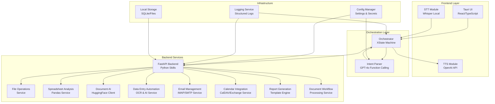

### System Architecture Layers

1. **Frontend Layer**: Tauri-based UI with voice I/O capabilities
2. **Orchestration Layer**: XState-managed workflow and intent processing
3. **Backend Services**: FastAPI-based microservices for core functionality
4. **Infrastructure**: Configuration, logging, and data persistence

## Sequence Diagrams

### Flow 1: Create File and Write Text

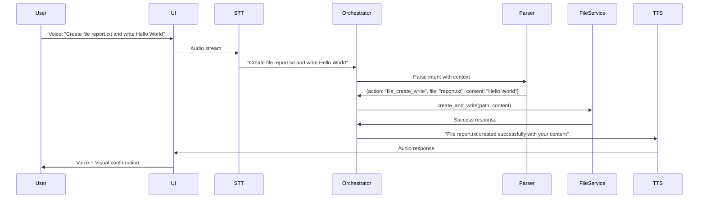

### Flow 2: Analyze Spreadsheet Salary Column Sum

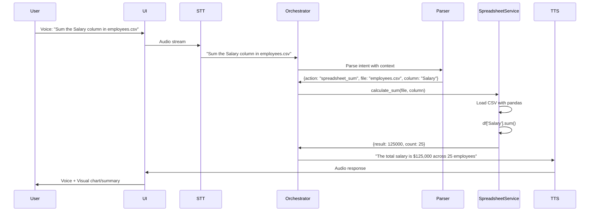

### Flow 3: Summarize PDF in 3 Bullets

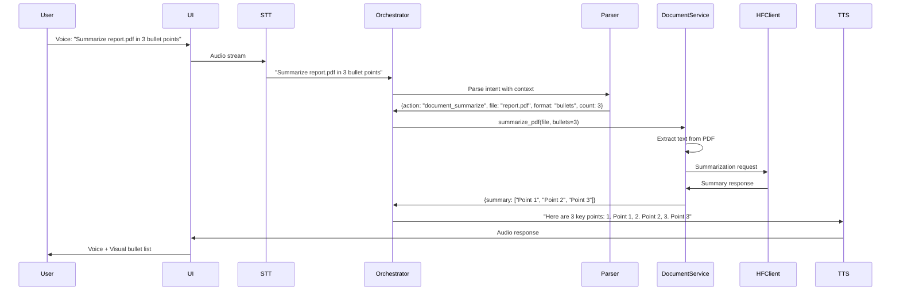

### Flow 4: Automate Invoice Data Extraction

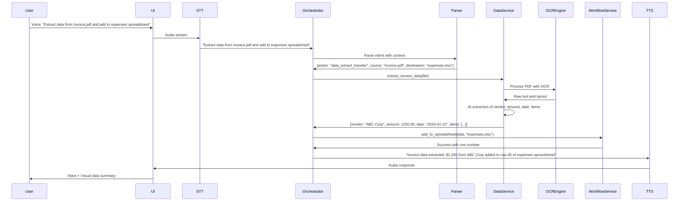

### Flow 5: Schedule Multi-Participant Meeting

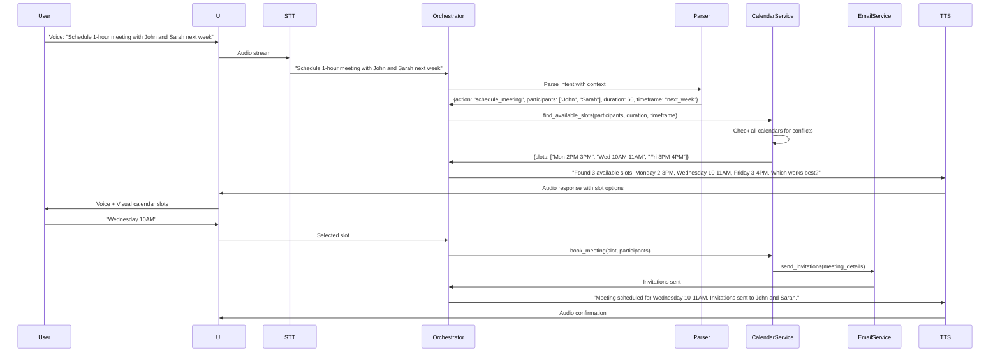

### Flow 6: Generate Weekly Sales Report

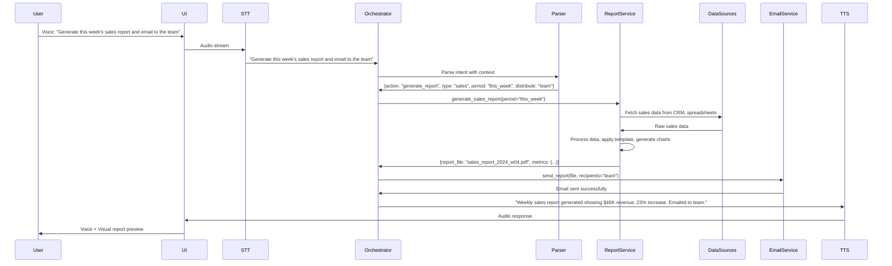

## State Machine Design

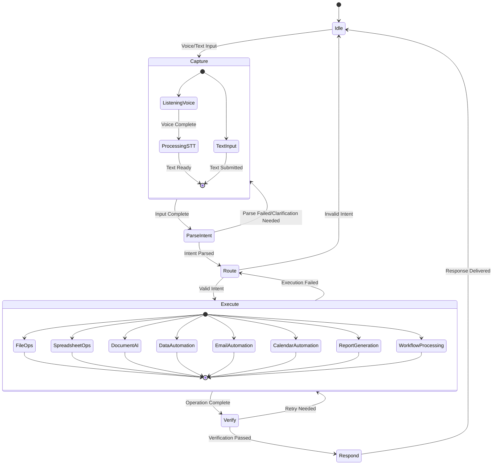

## Components and Interfaces

### Core Components

#### 1. Tauri UI Layer
- **Technology**: React + TypeScript + Tauri
- **Responsibilities**: User interface, voice I/O coordination, visual feedback
- **Interfaces**: 
  - `VoiceInterface`: STT/TTS management
  - `UIStateManager`: React state synchronization with XState

#### 2. Orchestrator (XState)
- **Technology**: XState v5
- **Responsibilities**: Workflow management, state transitions, error handling
- **Interfaces**:
  - `StateMachine`: Core state management
  - `EventBus`: Inter-component communication

#### 3. Intent Parser
- **Technology**: GPT-4o Function Calling
- **Responsibilities**: Natural language understanding, command parsing
- **Interfaces**:
  - `IntentParser`: Parse user input to structured commands
  - `FunctionSchema`: Strict JSON schema definitions

#### 4. Backend Services (FastAPI)
- **Technology**: FastAPI + Python
- **Responsibilities**: Business logic execution, data processing
- **Services**:
  - `FileOperationsService`: File system interactions
  - `SpreadsheetService`: Pandas-based data analysis
  - `DocumentAIService`: PDF processing and AI integration
  - `DataAutomationService`: OCR and data extraction/transfer
  - `EmailManagementService`: IMAP/SMTP email processing and automation
  - `CalendarService`: Calendar integration and scheduling automation
  - `ReportGenerationService`: Automated report compilation and formatting
  - `WorkflowProcessingService`: Document workflow and approval routing

#### 5. STT/TTS Modules
- **STT**: Whisper (local processing)
- **TTS**: OpenAI TTS API
- **Interfaces**:
  - `SpeechToText`: Audio → Text conversion
  - `TextToSpeech`: Text → Audio conversion

## Data Models

### Intent Schema
```typescript
interface ParsedIntent {
  action: 'file_create' | 'file_write' | 'spreadsheet_analyze' | 'document_summarize' | 
          'data_extract' | 'data_transfer' | 'email_sort' | 'email_respond' | 
          'schedule_meeting' | 'calendar_check' | 'generate_report' | 'process_workflow';
  parameters: {
    // File operations
    file?: string;
    content?: string;
    
    // Spreadsheet operations
    column?: string;
    operation?: 'sum' | 'average' | 'find';
    
    // Document operations
    format?: 'bullets' | 'paragraph';
    count?: number;
    
    // Data automation
    source?: string;
    destination?: string;
    extractionType?: 'invoice' | 'contract' | 'form' | 'receipt';
    
    // Email automation
    emailRules?: EmailRule[];
    templateId?: string;
    recipients?: string[];
    
    // Calendar automation
    participants?: string[];
    duration?: number;
    timeframe?: string;
    meetingType?: 'internal' | 'client' | 'interview';
    
    // Report generation
    reportType?: 'sales' | 'financial' | 'performance' | 'custom';
    period?: 'daily' | 'weekly' | 'monthly' | 'quarterly';
    dataSources?: string[];
    
    // Workflow processing
    workflowType?: 'approval' | 'review' | 'routing';
    approvers?: string[];
    priority?: 'low' | 'medium' | 'high' | 'urgent';
  };
  confidence: number;
  context?: string;
}

interface EmailRule {
  condition: string;
  action: 'move' | 'label' | 'forward' | 'respond';
  target: string;
}
```

### State Context
```typescript
interface AuraContext {
  currentInput: string;
  parsedIntent?: ParsedIntent;
  executionResult?: any;
  errorState?: ErrorInfo;
  userPreferences: UserConfig;
  sessionHistory: ConversationTurn[];
}
```

### Configuration Model
```typescript
interface AuraConfig {
  voice: {
    sttEnabled: boolean;
    ttsEnabled: boolean;
    language: string;
  };
  privacy: {
    cloudServicesEnabled: boolean;
    dataRetention: number;
  };
  services: {
    openaiApiKey?: string;
    huggingfaceApiKey?: string;
  };
}
```

## Automation Architecture

### Data Processing Pipeline

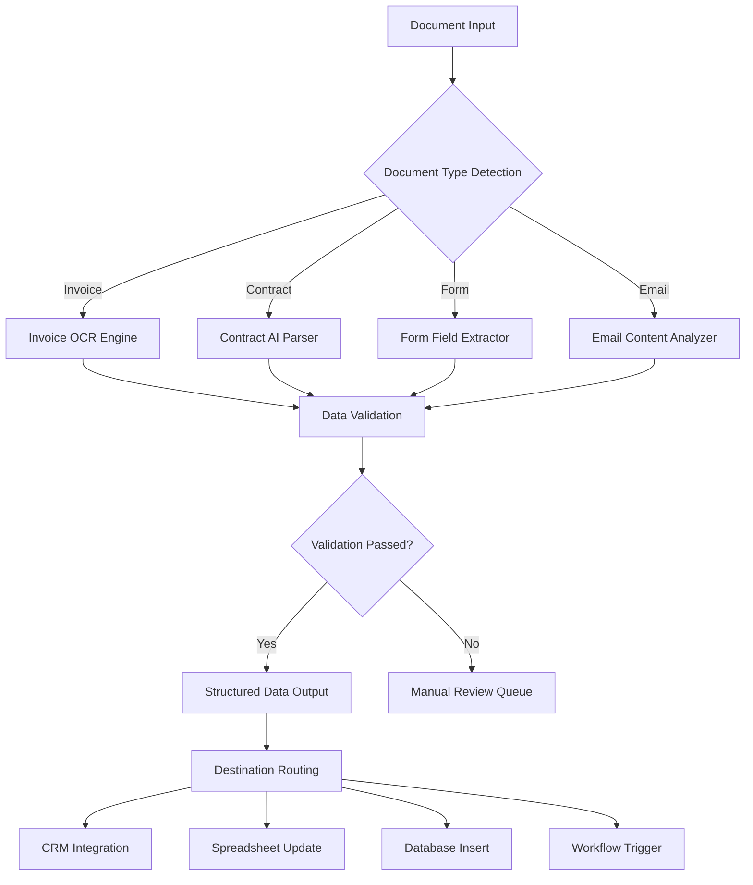

### Email Automation Flow

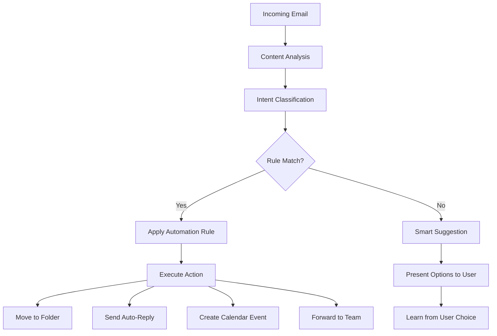

### Calendar Scheduling Algorithm

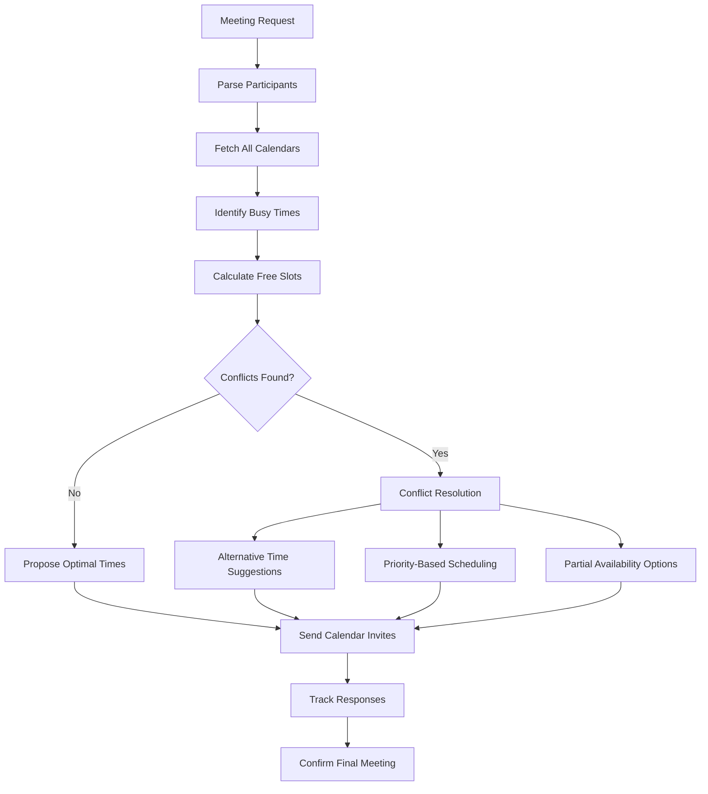

## Technology Tradeoffs

### Tauri vs Electron

**Chosen: Tauri**

**Pros:**
- Smaller bundle size (~10MB vs ~100MB)
- Better performance (Rust backend)
- Lower memory footprint
- Native OS integration
- Better security model

**Cons:**
- Smaller ecosystem
- Rust learning curve for backend
- Less mature tooling

**Alternative Considered:** Electron would provide larger ecosystem and easier JavaScript development but at the cost of performance and resource usage.

### GPT-4o vs Local NLP

**Chosen: GPT-4o with Local Fallback**

**Pros:**
- Superior intent understanding
- Function calling capabilities
- Handles complex, ambiguous queries
- Regular model improvements

**Cons:**
- Requires internet connectivity
- API costs
- Privacy considerations
- Latency for cloud calls

**Alternative Considered:** Local models (spaCy, transformers) would provide privacy and offline capability but with significantly reduced accuracy for complex intent parsing.

### OCR Engine Selection

**Chosen: Tesseract + PaddleOCR Hybrid**

**Pros:**
- Tesseract: Excellent for typed text, open source, mature
- PaddleOCR: Superior for handwritten text, table detection
- Combined approach maximizes accuracy across document types
- Local processing maintains privacy

**Cons:**
- Larger model footprint
- Requires GPU for optimal PaddleOCR performance
- More complex integration

**Alternative Considered:** Cloud OCR services (Google Vision, AWS Textract) would provide higher accuracy but compromise privacy and require internet connectivity.

### Email Integration Approach

**Chosen: IMAP/SMTP with OAuth 2.0**

**Pros:**
- Universal compatibility with email providers
- Secure authentication without password storage
- Real-time email processing capability
- Granular permission control

**Cons:**
- Complex OAuth setup for multiple providers
- Rate limiting considerations
- Requires internet connectivity

**Alternative Considered:** Exchange Web Services (EWS) would provide deeper Outlook integration but limit compatibility with other email providers.

### Calendar Integration Strategy

**Chosen: CalDAV + Exchange Web Services**

**Pros:**
- CalDAV: Universal standard, works with most calendar systems
- EWS: Deep Outlook/Exchange integration for enterprise users
- Covers majority of business calendar scenarios
- Supports real-time availability checking

**Cons:**
- Dual integration complexity
- Different authentication methods
- Varying feature support across providers

**Alternative Considered:** Google Calendar API only would be simpler but exclude many enterprise users.

### Whisper vs Vosk

**Chosen: Whisper (Local)**

**Pros:**
- State-of-the-art accuracy
- Multi-language support
- Robust to accents/noise
- Local processing (privacy)

**Cons:**
- Larger model size
- Higher computational requirements
- Slower than cloud alternatives

**Alternative Considered:** Vosk would be lighter and faster but with reduced accuracy, especially for technical terminology.

## Data Flow & Privacy

### Data Flow Architecture

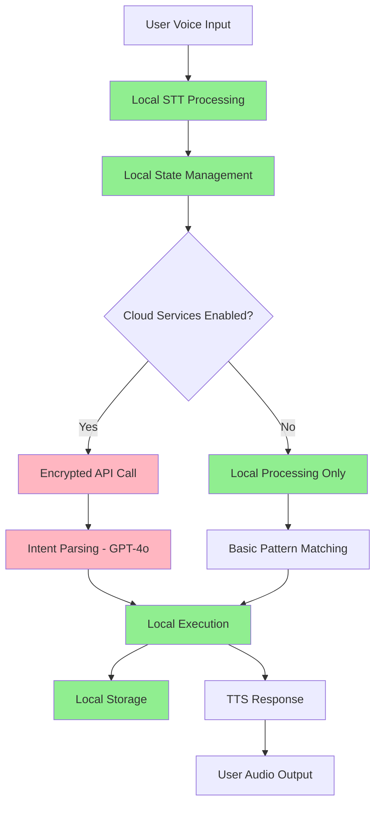

### Privacy Design Principles

#### 1. Local-First Processing
- **Voice Data**: All STT processing happens locally using Whisper
- **File Operations**: Direct local file system access, no cloud storage
- **Spreadsheet Analysis**: Local pandas processing, data never leaves device
- **State Management**: XState runs entirely locally

#### 2. Explicit Cloud Consent
- **Intent Parsing**: GPT-4o calls only with user permission
- **Document AI**: HuggingFace API calls require explicit consent
- **TTS**: OpenAI TTS with user awareness and opt-out capability

#### 3. Data Minimization
- **API Calls**: Only send necessary context, not full documents
- **Logging**: Structured logs with PII filtering
- **Storage**: Minimal local storage with automatic cleanup
- **Session Data**: Conversation history with configurable retention

#### 4. Security Measures
- **API Keys**: Stored in encrypted local configuration
- **Network**: HTTPS for all external communications
- **File Access**: Sandboxed file operations within user directories
- **Error Handling**: No sensitive data in error messages or logs
- **Email Security**: OAuth tokens encrypted at rest, minimal scope permissions
- **Document Processing**: Malware scanning before OCR processing
- **Calendar Access**: Read-only by default, explicit write permissions
- **Data Transfer**: Validation and sanitization for all automated data transfers

### Privacy Controls

```typescript
interface PrivacySettings {
  cloudServices: {
    intentParsing: boolean;
    documentAI: boolean;
    ttsService: boolean;
    ocrProcessing: boolean;
  };
  dataRetention: {
    conversationHistory: number; // days
    logFiles: number; // days
    tempFiles: number; // hours
    extractedData: number; // days
    emailCache: number; // days
    calendarCache: number; // days
    fileVersions: number; // days or version count
    commandHistory: number; // days or command count
  };
  security: {
    encryptLocalData: boolean;
    requireConfirmation: boolean;
    auditLogging: boolean;
    encryptVersions: boolean;
    secureVersionDeletion: boolean;
  };
  automation: {
    emailAccess: boolean;
    calendarAccess: boolean;
    documentProcessing: boolean;
    dataTransfer: boolean;
    reportGeneration: boolean;
    workflowAutomation: boolean;
  };
  permissions: {
    fileSystemAccess: string[]; // allowed directories
    emailAccounts: string[]; // authorized email accounts
    calendarSources: string[]; // authorized calendar sources
    externalIntegrations: string[]; // CRM, databases, etc.
  };
  versioning: {
    enableAutoVersioning: boolean;
    maxVersionsPerFile: number;
    maxStorageSize: number; // MB
    enableDifferentialVersioning: boolean;
    autoCleanupEnabled: boolean;
  };
}
```

## State Management and Versioning Architecture

### Versioning System Design

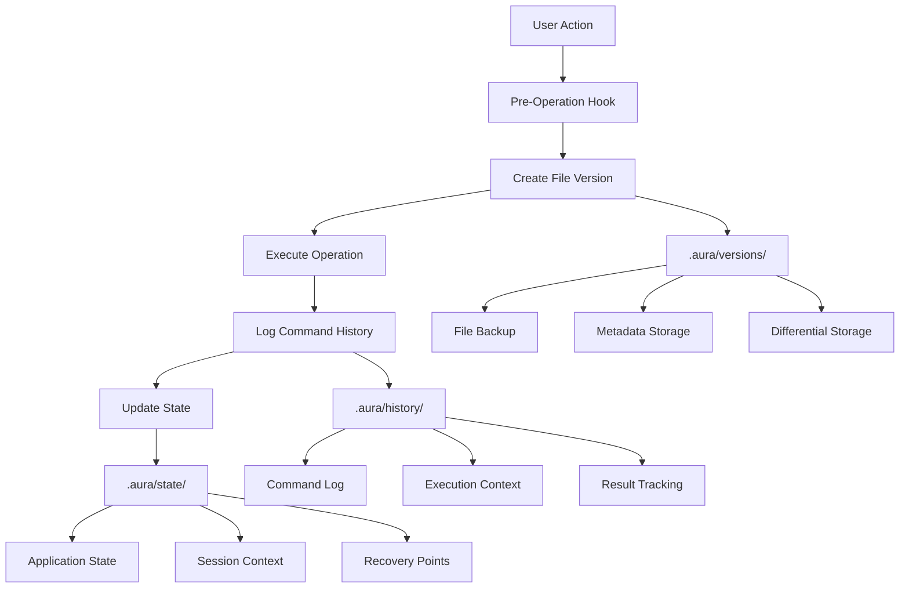

### .aura Directory Structure

```
.aura/
├── versions/                    # File versioning system
│   ├── {file_path_hash}/       # Hashed file path directory
│   │   ├── {timestamp_1}/      # Version timestamp
│   │   │   ├── content         # File content
│   │   │   ├── metadata.json   # Version metadata
│   │   │   └── diff.patch      # Differential changes
│   │   └── {timestamp_2}/
│   └── index.json              # Version index and lookup
├── history/                    # Command and execution history
│   ├── commands.jsonl          # Command execution log
│   ├── sessions/               # Session-based history
│   │   └── {session_id}.json   # Session command history
│   └── index.json              # History index and search
├── state/                      # Application state management
│   ├── checkpoints/            # State checkpoints
│   ├── recovery/               # Recovery points
│   └── current.json            # Current application state
├── config/                     # Versioning configuration
│   ├── retention.json          # Retention policies
│   ├── storage.json            # Storage settings
│   └── security.json           # Security configuration
└── logs/                       # System logs
    ├── versioning.log          # Versioning operations
    ├── cleanup.log             # Cleanup operations
    └── errors.log              # Error tracking
```

### Versioning Data Models

```typescript
interface FileVersion {
  id: string;
  filePath: string;
  timestamp: Date;
  size: number;
  checksum: string;
  changeDescription: string;
  operationType: 'create' | 'modify' | 'delete';
  commandId: string;
  metadata: {
    originalSize: number;
    compressionRatio: number;
    isDifferential: boolean;
    parentVersion?: string;
  };
}

interface CommandHistoryEntry {
  id: string;
  timestamp: Date;
  sessionId: string;
  userInput: string;
  parsedIntent: ParsedIntent;
  executionDuration: number;
  success: boolean;
  errorMessage?: string;
  affectedFiles: string[];
  beforeState: Record<string, any>;
  afterState: Record<string, any>;
  rollbackData?: RollbackData;
}

interface RollbackData {
  operationType: string;
  affectedFiles: FileRollbackInfo[];
  stateChanges: StateChange[];
  dependencies: string[]; // Other commands that depend on this
}

interface FileRollbackInfo {
  filePath: string;
  beforeVersion: string;
  afterVersion: string;
  operation: 'created' | 'modified' | 'deleted';
}

interface StateCheckpoint {
  id: string;
  timestamp: Date;
  description: string;
  applicationState: Record<string, any>;
  fileStates: Record<string, string>; // file path -> version id
  commandCount: number;
  isAutomatic: boolean;
}
```

### Rollback System Architecture

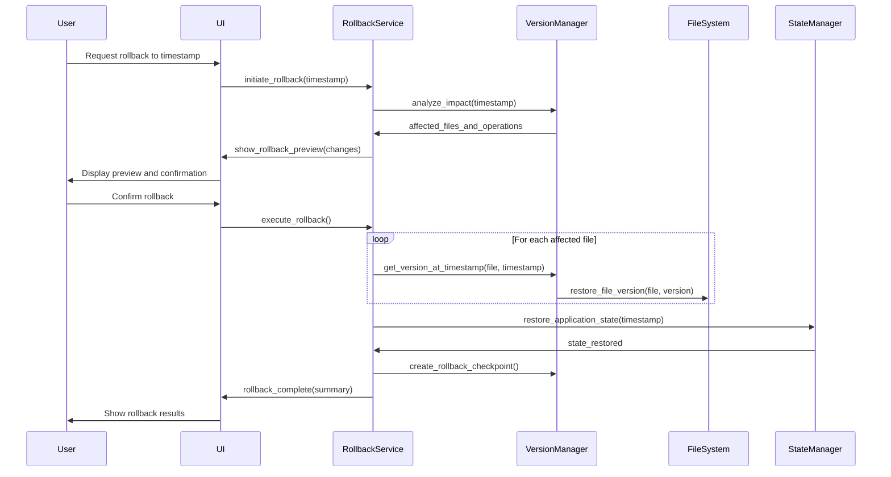
```

## Error Handling

### Error Categories
1. **Voice Processing Errors**: STT failures, audio device issues
2. **Intent Parsing Errors**: Ambiguous commands, API failures
3. **Execution Errors**: File access denied, network timeouts
4. **System Errors**: State corruption, service unavailability

### Recovery Strategies
- **Graceful Degradation**: Fall back to text mode when voice fails
- **Retry Logic**: Exponential backoff for transient failures
- **User Guidance**: Clear error messages with suggested actions
- **State Recovery**: XState error states with recovery transitions

## Testing Strategy

### Unit Testing
- **Component Tests**: React components with Jest/RTL
- **Service Tests**: FastAPI endpoints with pytest
- **State Machine Tests**: XState machine behavior verification

### Integration Testing
- **Voice Flow Tests**: End-to-end voice command processing
- **API Integration**: External service integration testing
- **Cross-Platform Tests**: Windows/Linux compatibility verification

### Performance Testing
- **Voice Latency**: STT/TTS response time measurement
- **Memory Usage**: Resource consumption monitoring
- **File Processing**: Large file handling performance

This design provides a robust, privacy-focused architecture that balances local processing with cloud capabilities while maintaining user control and system reliability.