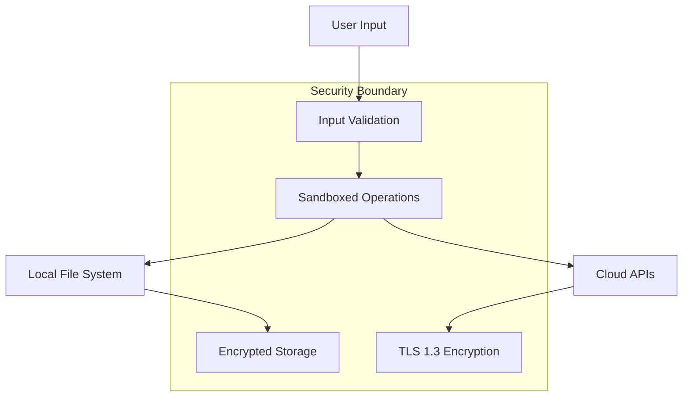

# Security Policy

## 🔒 Security Overview

Aura Desktop Assistant takes security seriously. This document outlines our security practices, how to report vulnerabilities, and what you can expect from our security response process.

## 🛡️ Security Features

### Local-First Architecture
- **Voice Processing**: All speech-to-text processing happens locally using Whisper
- **Data Storage**: User data stored locally with AES-256 encryption
- **File Operations**: Sandboxed file access within user directories
- **State Management**: All application state managed locally

### Cloud Service Security
- **Explicit Consent**: Cloud services require explicit user permission
- **Data Minimization**: Only necessary data sent to cloud APIs
- **Encrypted Transit**: All API calls use TLS 1.3 encryption
- **No Data Retention**: Cloud providers don't store user data

### Application Security
- **Input Validation**: Comprehensive validation of all user inputs
- **Path Traversal Protection**: Prevents unauthorized file system access
- **Secure Configuration**: Encrypted storage of API keys and settings
- **Memory Safety**: Rust backend provides memory safety guarantees

## 🚨 Supported Versions

We provide security updates for the following versions:

| Version | Supported          |
| ------- | ------------------ |
| 1.x.x   | ✅ Yes             |
| 0.x.x   | ❌ No              |

## 📢 Reporting a Vulnerability

### 🚨 Critical Security Issues

**DO NOT** create public GitHub issues for security vulnerabilities.

For security issues, please email: **security@aura-assistant.com**

### 📧 What to Include

Please include the following information:

1. **Description**: Clear description of the vulnerability
2. **Impact**: Potential impact and severity assessment
3. **Reproduction**: Step-by-step instructions to reproduce
4. **Environment**: Operating system, version, and configuration
5. **Proof of Concept**: Code or screenshots demonstrating the issue
6. **Suggested Fix**: If you have ideas for remediation

### 📝 Example Report

```
Subject: [SECURITY] Potential Path Traversal in File Operations

Description:
The file creation endpoint may be vulnerable to path traversal attacks,
allowing users to create files outside the designated user directory.

Impact:
An attacker could potentially create files in system directories,
leading to privilege escalation or system compromise.

Reproduction Steps:
1. Send voice command: "Create file ../../etc/malicious.txt"
2. Observe that file is created outside user directory
3. System files may be overwritten

Environment:
- OS: Ubuntu 22.04
- Aura Version: 1.0.0
- Installation: Built from source

Proof of Concept:
[Include code or screenshots]

Suggested Fix:
Implement strict path validation to ensure all file operations
remain within the user's designated directory.
```

## ⏱️ Response Timeline

We are committed to responding to security reports promptly:

| Timeline | Action |
|----------|--------|
| 24 hours | Initial acknowledgment |
| 72 hours | Initial assessment and severity classification |
| 7 days   | Detailed investigation and response plan |
| 30 days  | Fix development and testing |
| Release  | Security patch deployment |

### Severity Classification

- **Critical**: Immediate threat to user data or system security
- **High**: Significant security risk requiring urgent attention
- **Medium**: Important security issue with moderate impact
- **Low**: Minor security concern with limited impact

## 🔍 Security Audit Process

### Automated Security Scanning

Our CI/CD pipeline includes:

- **SAST**: Static Application Security Testing with Semgrep
- **Dependency Scanning**: Automated vulnerability detection with Dependabot
- **Secret Scanning**: Detection of exposed credentials with TruffleHog
- **Container Scanning**: Docker image vulnerability assessment with Trivy
- **Code Analysis**: GitHub CodeQL for security issue detection

### Manual Security Reviews

- **Code Reviews**: All code changes reviewed for security implications
- **Architecture Reviews**: Security assessment of design changes
- **Penetration Testing**: Regular security testing by external experts
- **Threat Modeling**: Systematic analysis of potential threats

## 🛠️ Security Best Practices for Contributors

### Code Security

1. **Input Validation**: Always validate and sanitize user inputs
2. **Error Handling**: Don't expose sensitive information in error messages
3. **Authentication**: Secure all API endpoints appropriately
4. **Encryption**: Use strong encryption for sensitive data
5. **Dependencies**: Keep dependencies updated and scan for vulnerabilities

### Example: Secure Input Validation

```typescript
// Good: Proper input validation
function createFile(filename: string, content: string): Result<void, Error> {
  // Validate filename
  if (!isValidFilename(filename)) {
    return Err(new Error("Invalid filename"));
  }
  
  // Sanitize path
  const safePath = sanitizePath(filename);
  
  // Check if path is within allowed directory
  if (!isWithinUserDirectory(safePath)) {
    return Err(new Error("Path not allowed"));
  }
  
  // Proceed with file creation
  return createFileSecurely(safePath, content);
}

// Bad: No validation
function createFile(filename: string, content: string) {
  fs.writeFileSync(filename, content); // Vulnerable to path traversal
}
```

### Secure Configuration

```rust
// Good: Secure configuration handling
pub struct SecureConfig {
    encrypted_api_keys: EncryptedData,
    user_preferences: UserPrefs,
}

impl SecureConfig {
    pub fn load() -> Result<Self, ConfigError> {
        let encrypted_data = load_encrypted_config()?;
        let decrypted_keys = decrypt_with_user_key(encrypted_data)?;
        
        Ok(SecureConfig {
            encrypted_api_keys: decrypted_keys,
            user_preferences: load_user_preferences()?,
        })
    }
}
```

## 🔐 Security Architecture

### Threat Model

We consider the following threat vectors:

1. **Malicious Voice Commands**: Attempts to execute harmful operations
2. **Path Traversal**: Unauthorized file system access
3. **API Abuse**: Misuse of cloud service integrations
4. **Data Exfiltration**: Unauthorized access to user data
5. **Privilege Escalation**: Attempts to gain system-level access

### Security Controls

| Threat | Control | Implementation |
|--------|---------|----------------|
| Malicious Commands | Input Validation | Strict command parsing and validation |
| Path Traversal | Sandboxing | Restricted file operations within user directories |
| API Abuse | Rate Limiting | Request throttling and usage monitoring |
| Data Exfiltration | Encryption | AES-256 encryption for all sensitive data |
| Privilege Escalation | Least Privilege | Minimal required permissions |

### Security Boundaries



## 📊 Security Metrics

We track the following security metrics:

- **Vulnerability Response Time**: Average time to patch security issues
- **Dependency Freshness**: Percentage of dependencies up-to-date
- **Test Coverage**: Security test coverage percentage
- **Scan Results**: Number of security issues detected and resolved

## 🎯 Security Roadmap

### Current (v1.0)
- [x] Local-first architecture
- [x] Input validation framework
- [x] Encrypted configuration storage
- [x] Automated security scanning

### Near Term (v1.1)
- [ ] Hardware security module integration
- [ ] Advanced threat detection
- [ ] Security audit logging
- [ ] Penetration testing automation

### Long Term (v2.0)
- [ ] Zero-trust architecture
- [ ] Formal security verification
- [ ] Security compliance certifications
- [ ] Advanced encryption schemes

## 📚 Security Resources

### Documentation
- [OWASP Top 10](https://owasp.org/www-project-top-ten/)
- [Rust Security Guidelines](https://anssi-fr.github.io/rust-guide/)
- [Tauri Security Guide](https://tauri.app/v1/guides/security/)
- [Node.js Security Best Practices](https://nodejs.org/en/docs/guides/security/)

### Tools
- [Semgrep](https://semgrep.dev/) - Static analysis
- [TruffleHog](https://github.com/trufflesecurity/trufflehog) - Secret scanning
- [Trivy](https://trivy.dev/) - Vulnerability scanning
- [CodeQL](https://codeql.github.com/) - Code analysis

## 🏆 Security Hall of Fame

We recognize security researchers who help improve Aura's security:

<!-- Security researchers will be listed here -->

## 📞 Contact

- **Security Email**: security@aura-assistant.com
- **PGP Key**: [Download PGP Key](https://aura-assistant.com/security.asc)
- **Security Team**: security-team@aura-assistant.com

## 📄 Disclosure Policy

We follow responsible disclosure practices:

1. **Private Reporting**: Security issues reported privately first
2. **Coordinated Disclosure**: Work with researchers on disclosure timeline
3. **Public Disclosure**: Issues disclosed after fixes are available
4. **Credit**: Security researchers credited for their contributions

---

Thank you for helping keep Aura Desktop Assistant secure! 🔒